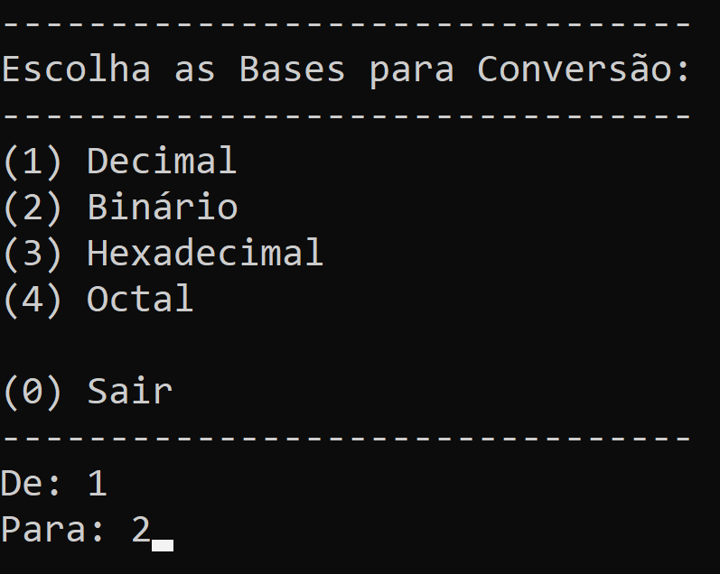
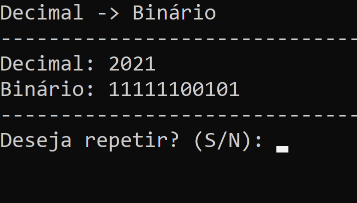

# Conversor de Bases Numéricas
Conversor de bases numéricas executado em console. Converte um número em determinada base para outra base escolhida! 

### **Bases disponíveis para conversão são:** 
- Binária
- Octal 
- Decimal 
- Hexadecimal 

## **Capturas de tela**

Menu Principal             | Exemplo de Conversão
:-------------------------:|:-------------------------:
  |  
